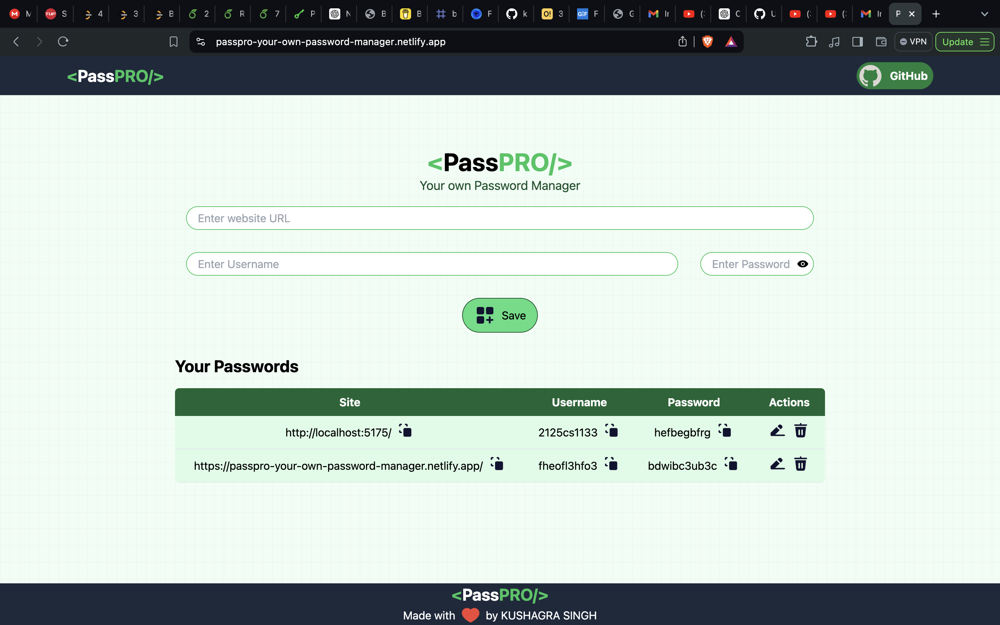
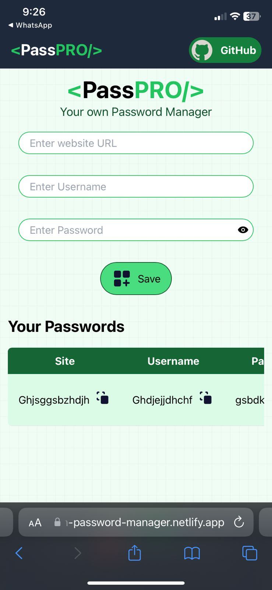

# PassPRO - Your Own Password Manager

PassPRO is a secure and user-friendly password manager built using React. This project has two versions: one using local storage for data storage, and the other using Express and MongoDB for a more robust backend solution.

## Features

- Secure password storage
- Easy-to-use interface
- Two storage options:
  - Local Storage (Frontend only)
  - Express and MongoDB (Full Stack)

## Project Structure

The project is divided into two versions:

1. **Local Storage Version**: Stores data in the browser's local storage.
2. **Express and MongoDB Version**: Uses Express for the backend and MongoDB for data storage.

## Usage

1. **Add a Password**: Use the form to add a new password.
2. **View Passwords**: View your stored passwords in the list.
3. **Delete Passwords**: Remove passwords from the list.
4. **Edit Passwords**: You can also edit your passwords.

## Screenshots

PC view:-

Phone view:-

## Contributing

1. Fork the repository.
2. Create your feature branch (`git checkout -b feature/YourFeature`).
3. Commit your changes (`git commit -m 'Add some feature'`).
4. Push to the branch (`git push origin feature/YourFeature`).
5. Open a pull request.

## Contact

Kushagra Singh - [kushagra.cs.singh@gmail.com](mailto:kushagra.cs.singh@gmail.com)

Project Link: [https://github.com/kushagra-2o22/PassPRO-Your-Own-Password-Manager](https://github.com/kushagra-2o22/PassPRO-Your-Own-Password-Manager)

Website Link: [https://passpro-your-own-password-manager.netlify.app/](https://passpro-your-own-password-manager.netlify.app/)
